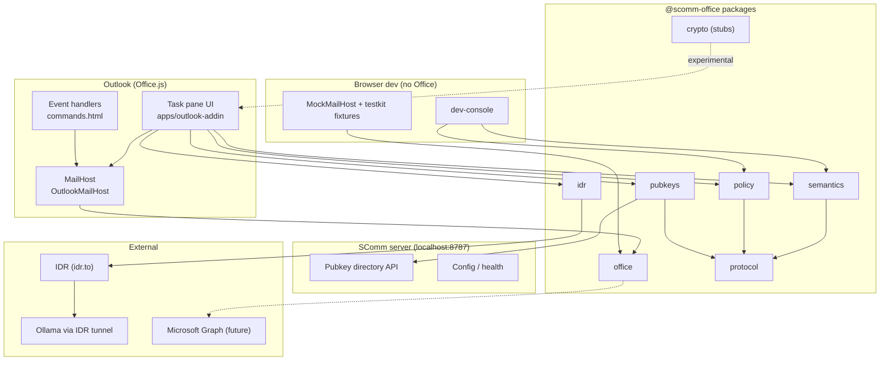

# SComm Office

**SComm Office** is an Outlook-hosted capability layer for [SComm](https://github.com/scomm-ai) — semantic mail understanding, identity/public-key discovery, compliance policy, billing entitlements, and bring-your-own AI (local via [IDR](https://idr.to), cloud BYOAI), constrained by explicit trust boundaries and OpenSpec decisions. Standing goal: bring as much of SComm (secMail) into Office hosts as possible, starting with Outlook ([constitution](./openspec/constitution.md)).

This monorepo ships:

- **`apps/outlook-addin`** — React 19 + Vite task pane (HTTPS dev server, Office.js manifest) — **product**
- **`apps/dev-console`** — browser fixture runner for semantics + policy debugging
- **`apps/server`** — Fastify **fixture only** (not required for product paths)
- **`packages/*`** — shared TypeScript libraries (`@scomm-office/*`), including `billing` and `byoai`

> **Client-first:** Auth/billing talk to the billing host; public keys to the production pubkey service; IDR is an embedded third-party SDK. See [005-no-office-server](./openspec/architecture/005-no-office-server.md).

> **MVP honesty:** E2EE is stubbed, durable private-key storage is deferred, pubkey write/bootstrap is P1, and several Outlook capabilities (OnMessageSend soft block, WebRTC in all hosts) remain under investigation. See [OpenSpec](./openspec/README.md) and limitations below.

## Architecture



## Monorepo map

| Path | Package / app | Role |
|------|-----------------|------|
| `apps/outlook-addin` | `@scomm-office/outlook-addin` | Outlook task pane + manifest |
| `apps/dev-console` | `@scomm-office/dev-console` | Fixture semantics/policy debugger |
| `apps/server` | `@scomm-office/server` | Fastify API *(scaffold planned)* |
| `packages/core` | `@scomm-office/core` | Errors, UID, email normalization |
| `packages/office` | `@scomm-office/office` | `MailHost`, capabilities, metadata adapter |
| `packages/semantics` | `@scomm-office/semantics` | Heuristic semantic extraction, digest |
| `packages/policy` | `@scomm-office/policy` | Deterministic compliance engine |
| `packages/pubkeys` | `@scomm-office/pubkeys` | `HttpPublicKeyDirectory`, key resolution |
| `packages/idr` | `@scomm-office/idr` | IDR browser transport, Ollama provider |
| `packages/protocol` | `@scomm-office/protocol` | Zod DTOs, `X-SComm-*` headers |
| `packages/crypto` | `@scomm-office/crypto` | E2EE interfaces (**stubs**) |
| `packages/storage` | `@scomm-office/storage` | Settings + dev key store |
| `packages/config` | `@scomm-office/config` | Effective configuration merge |
| `packages/testkit` | `@scomm-office/testkit` | HTML fixtures |
| `openspec/` | — | Architecture & security decisions |

Workspace discovery: `pnpm-workspace.yaml` includes `apps/*` and `packages/*`.

## Prerequisites

- **Node.js ≥ 24** (see `.nvmrc`)
- **pnpm 9.x** (`corepack enable && corepack prepare pnpm@9.15.0 --activate`)
- **Outlook** desktop or web for sideloading (see [docs/sideload.md](./docs/sideload.md))
- **PostgreSQL** on `localhost:5433` for future persistence (`DATABASE_URL` in `.env`) — MVP server uses in-memory stores when present

## Quick start

```bash
pnpm install
cp .env.example .env   # adjust URLs as needed

# Run add-in (HTTPS :5173) + dev-console (:5174)
pnpm --filter @scomm-office/outlook-addin dev
pnpm --filter @scomm-office/dev-console dev

# Or parallel dev (includes server when available):
pnpm dev
```

Open **https://localhost:5173/taskpane.html** in a browser (accept the self-signed cert) to use **MockMailHost** without Outlook.

## Configuration

Copy `.env.example` to `.env` at the repo root. Vite apps read `VITE_*` variables:

| Variable | Default | Purpose |
|----------|---------|---------|
| `VITE_SCOMM_SERVER_URL` | `http://localhost:8787` | SComm server base URL |
| `VITE_PUBKEY_SERVER_URL` | same as above | Public key directory |
| `VITE_IDR_HOST` | *(empty)* | Your IDR tunnel host |
| `VITE_IDR_SERVICE` | `ollama` | IDR service name for BYOM |
| `DATABASE_URL` | `postgres://...@localhost:5433/scomm_office` | Future Postgres (port **5433**) |

Task pane **Settings** also persist to `localStorage` via `MemoryUserSettingsStore`.

## Sideloading Outlook add-in

See **[docs/sideload.md](./docs/sideload.md)** for step-by-step sideload of `apps/outlook-addin/manifest/manifest.xml` against `https://localhost:5173`.

Trust the dev HTTPS certificate before sideloading. Manifest `AppDomains` include `localhost`.

## Development scripts

| Command | Description |
|---------|-------------|
| `pnpm dev` | Parallel dev for server + add-in + dev-console |
| `pnpm build` | Build all packages and apps |
| `pnpm typecheck` | TypeScript across workspace |
| `pnpm test` | Vitest in all packages/apps |
| `pnpm lint` | ESLint |
| `pnpm format` | Prettier |

Per app:

```bash
pnpm --filter @scomm-office/outlook-addin dev      # https://localhost:5173
pnpm --filter @scomm-office/dev-console dev        # http://localhost:5174
```

## Semantics pipeline

1. **Raw mail** (`bodyHtml` / `bodyText`) from `MailHost`
2. **`HeuristicSemanticExtractor`** → typed segments (authored, quoted, signature, legalese, …)
3. **`sha256SemanticDocument`** → semantic digest for headers
4. **`ScommMessageMetadataAdapter`** writes compact `X-SComm-*` headers in compose mode (Mailbox 1.8+)
5. **`DeterministicPolicyEngine`** evaluates compliance findings; **`mapPolicyToSendDecision`** for send-time hints

Use **dev-console** to iterate on fixtures without Outlook.

## Identity & pubkeys

- Lookup via **`HttpPublicKeyDirectory`** (`GET /api/v1/identities/email/{email}/keys`)
- Compose-time recipient encryption key status via **`resolveRecipientKeys`**
- Dev-only **`DevMemoryKeyStore`** + **SET** publishes a fake signing key — never for production

See [openspec/features/pubkey-server-api.md](./openspec/features/pubkey-server-api.md).

## BYOM / IDR

The add-in wraps **`@idrto/idr_browser_sdk`** through **`IdrBrowserTransport`**:

1. **Authenticate** (interactive, auth mount div)
2. **Connect** to your IDR host
3. **List models** via **`OllamaViaIdrProvider`**

CSP in `taskpane.html` allows `idr.to` and Microsoft login/graph endpoints. Runtime support is probed with **`detectIdrRuntimeSupport`** (WebRTC + Ed25519).

See [openspec/architecture/003-idr-transport.md](./openspec/architecture/003-idr-transport.md).

## Security caveats

- **No production E2EE** — `ExperimentalMessageEncryptor` / `Decryptor` throw by design
- **Dev keys only** — `DevMemoryKeyStore` is in-memory and fake
- **AI trust boundary** — model output must not drive privileged actions without validation ([openspec/security/ai-trust-boundary.md](./openspec/security/ai-trust-boundary.md))
- **Hostile HTML** — semantic extraction strips scripts but mail bodies are untrusted input
- **CSP** — task pane uses a restrictive meta policy; adjust carefully for new endpoints

Full threat model: [openspec/security/threat-model.md](./openspec/security/threat-model.md).

## Supported environments (honest)

| Environment | Status |
|-------------|--------|
| Outlook on the web + Edge/Chrome | Task pane dev target; validate headers & IDR per tenant |
| New Outlook for Windows | Primary desktop target; requirement sets vary |
| Classic Outlook Windows | Event handlers may need classic override paths |
| Outlook Mac | Best-effort; capability matrix not fully validated |
| Browser-only (no Office.js) | **Supported** via MockMailHost + dev-console |
| Mobile Outlook | **Not supported** for MVP task pane |

WebRTC inside Office hosts: **Under Investigation** ([openspec/microsoft/webrtc-host-support.md](./openspec/microsoft/webrtc-host-support.md)).

## Limitations (MVP)

- OnMessageSend / Smart Alerts manifest stubs only — handlers registered in `commands.html`, LaunchEvents commented
- No durable private-key storage ([openspec/security/private-key-storage.md](./openspec/security/private-key-storage.md))
- No `application/scomm+json` MIME parts ([openspec/features/scomm-mime.md](./openspec/features/scomm-mime.md))
- Microsoft Graph integration is interface-level only
- Server app may be absent in early clones — pubkey calls fail until server runs on `:8787`
- Playwright E2E for add-in: optional / not wired yet

## OpenSpec

All major decisions live under **[openspec/](./openspec/README.md)** — start with:

- [001-monorepo](./openspec/architecture/001-monorepo.md)
- [002-office-graph-boundary](./openspec/architecture/002-office-graph-boundary.md)
- [scomm-message-headers](./openspec/features/scomm-message-headers.md)
- [e2ee-protocol](./openspec/security/e2ee-protocol.md)

## License

Private monorepo — see repository settings.
