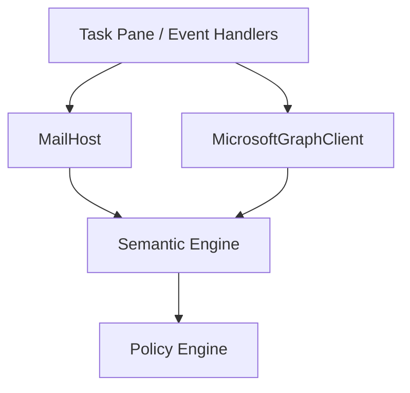

# 002 — Office.js vs Microsoft Graph Boundary

## Status

**Accepted**

## Context

Outlook add-ins interact with email through two distinct Microsoft APIs:

1. **Office.js** — operates on the *currently displayed or composed* mailbox item in the host UI
2. **Microsoft Graph** — REST API for mailbox-wide operations (search, conversation threads, contacts)

SComm Office must classify message body segments, stamp headers at send time, resolve public keys, and optionally enrich semantics with thread context. Mixing these APIs creates untestable code and incorrect assumptions about data availability.

## Problem

Office.js and Graph overlap conceptually (both expose messages) but differ in scope, latency, permissions, and platform support. Calling `Office.context.mailbox.item` from semantic parsing or policy code couples pure logic to the Outlook host. Using Graph for compose-time body edits is impossible. Using Office.js for mailbox-wide search is unsupported.

## Goals

- Single **`MailHost`** abstraction for all current-item operations
- Single **`MicrosoftGraphClient`** (or equivalent) for mailbox-wide operations
- Zero Office.js imports outside `packages/office`
- Zero Graph imports in `packages/semantics`, `packages/policy`, or UI components
- Mock implementations for unit tests (`MockMailHost`, `MockMicrosoftGraph`)

## Non-goals

- Abstracting away all Microsoft APIs behind one mega-interface
- Supporting non-Outlook mail hosts in MVP (interface designed for future hosts)
- Replacing Exchange transport or sync

## Constraints

- Office.js runs in a sandboxed iframe with requirement-set gates
- Graph requires OAuth tokens (Nested App Authentication when available)
- Event-based handlers (`OnMessageSend`) have strict execution time limits (~5 minutes max, but practical limit much lower for UX)
- Internet Headers require Mailbox requirement set 1.8+

## Proposed design

### Responsibility matrix

| Concern | API | Adapter |
|---------|-----|---------|
| Read/compose current item body | Office.js | `MailHost` |
| Read/set internet headers on current item | Office.js | `MailHost` |
| Recipients, subject, attachments (current item) | Office.js | `MailHost` |
| Compose mode detection | Office.js | `MailHost` |
| Conversation thread history | Graph | `MicrosoftGraphClient` |
| Search mailbox | Graph | `MicrosoftGraphClient` |
| Current user profile | Graph | `MicrosoftGraphClient` |
| Message by immutable ID | Graph | `MicrosoftGraphClient` |

### MailHost interface

```typescript
export interface MailHost {
  getCurrentMessage(): Promise<MailMessage>;
  getComposeState(): Promise<ComposeState | null>;
  setBody(options: BodyWriteOptions): Promise<void>;
  setHeaders(headers: Record<string, string>): Promise<void>;
  getHeaders(names?: string[]): Promise<Record<string, string>>;
  getAttachments(): Promise<MailAttachment[]>;
  isComposeMode(): Promise<boolean>;
}
```

Implementation: `OutlookMailHost` (production), `MockMailHost` (tests/dev-console).

Office.js specifics encapsulated:

- `Office.context.mailbox.item.body.getAsync` / `setAsync`
- `Office.context.mailbox.item.internetHeaders.getAsync` / `setAsync`
- Attachment APIs gated by capability registry
- Requirement-set checks before header operations

### Microsoft Graph adapter

```typescript
export interface MicrosoftGraphClient {
  getCurrentUser(): Promise<MicrosoftUser>;
  getMessageById(id: string): Promise<GraphMessage | null>;
  getConversationMessages(conversationId: string): Promise<GraphMessage[]>;
  searchMessages(query: string, options?: SearchOptions): Promise<GraphMessage[]>;
  getContacts(options?: ContactQuery): Promise<GraphContact[]>;
}
```

Initial MVP operations only; expand as features require.

### Data flow



Semantic engine receives a **`RawMailDocument`** assembled by a coordinator that may merge:

- Current item from `MailHost`
- Optional thread context from Graph `conversationId`

### Identity provider separation

Microsoft authentication is also isolated:

```typescript
interface MicrosoftIdentityProvider {
  getUser(): Promise<MicrosoftUser>;
  getGraphToken(scopes: string[]): Promise<string>;
}
```

MSAL / Nested App Authentication lives in `packages/microsoft-graph` or a dedicated auth module — not in UI components.

## Alternatives

| Alternative | Why rejected |
|-------------|--------------|
| Graph-only (no Office.js for compose) | Cannot set internet headers or intercept send on current draft |
| Office.js-only (no Graph) | Cannot reliably retrieve thread history; quoted-body parsing is fragile |
| Direct Office.js in React components | Untestable; violates separation |

## Security considerations

- Graph tokens never logged; scoped to least privilege
- `MailHost` validates header names before write (allowlist `X-SComm-*`)
- Graph responses validated with Zod at boundary
- Event handlers collect minimal metadata; no token forwarding to SComm server

## Compatibility

- `MockMailHost` enables dev-console and Vitest without Outlook
- Graph operations degrade gracefully when NAA unavailable (capability registry disables features)
- Read mode vs compose mode detected via `MailHost.isComposeMode()`

## Open questions

- Exact Graph scopes for conversation retrieval (likely `Mail.Read` or `Mail.ReadWrite`)
- Whether `Office.context.mailbox.item.conversationId` is sufficient to bootstrap Graph queries on all platforms
- Immutable message ID availability in read vs compose modes

## Decision

**MVP locks the MailHost / Graph split.** All Office.js access flows through `packages/office`. Graph is optional enrichment for thread semantics, not a substitute for current-item operations.

## Implementation status

| Item | Status |
|------|--------|
| `MailHost` interface spec | Accepted |
| `OutlookMailHost` | Planned (Milestone 3) |
| `MockMailHost` | Planned (Milestone 3) |
| `MicrosoftGraphClient` interface | Planned (Milestone 7) |
| MSAL NAA integration | Planned (Milestone 7) |

## Deferred work

- Additional mail hosts (SComm native client implementing `MailHost`)
- Graph batching and delta sync
- Shared mailbox / delegate access patterns
